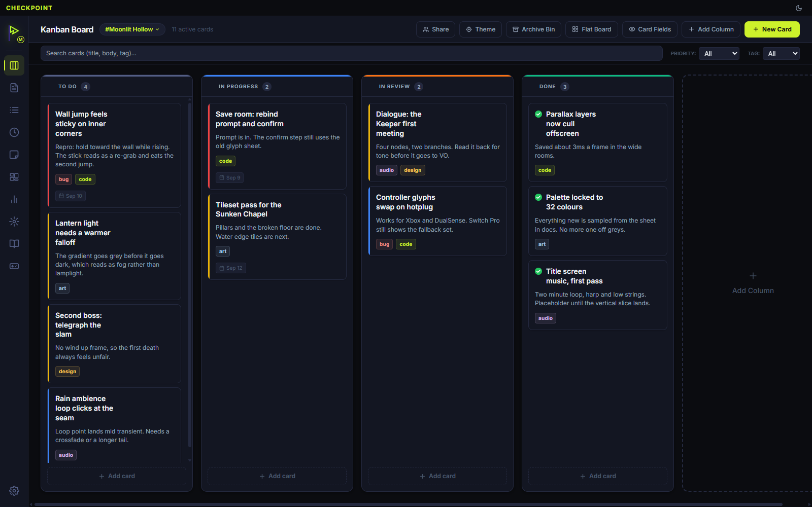
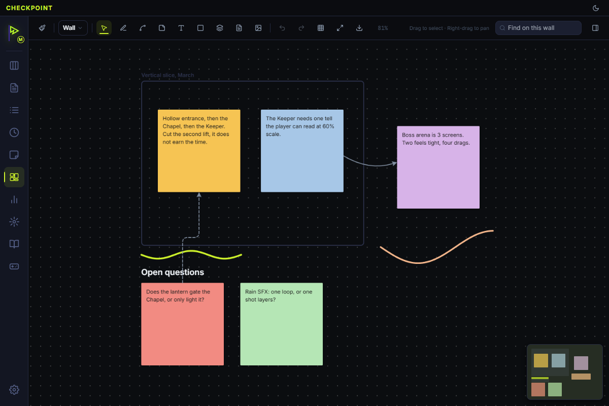
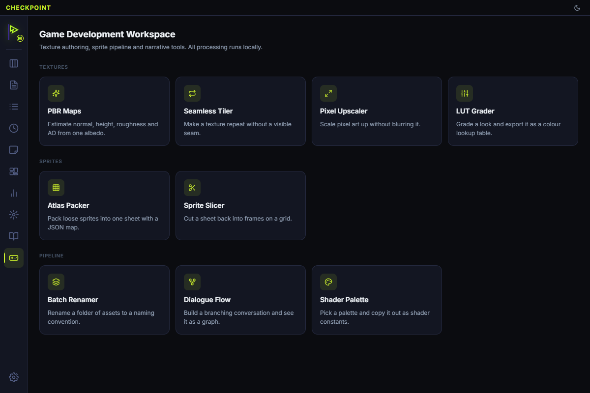

# Checkpoint

A local-first desktop workspace for keeping track of what you're doing.

I built this because I got tired of having twenty things open during a game dev
session. A board in one app, notes in another, a scratchpad in a third, some
texture utility in a fourth, a browser tab for the palette I picked last week.
Checkpoint is all of that in one window, on my machine, with no account.

It's a personal tool that got big enough to share. If it suits how you work,
take it.

## Screenshots

> Drop images into `docs/screenshots/`. See the note in that folder for sizes.



| The Wall | Game dev tools |
| --- | --- |
|  |  |

## What's in it

**Getting things down.** A daily log, a kanban board, a structured backlog, and
a pomodoro timer. Notes are plain Markdown files with `[[wiki links]]`, so
they're readable without Checkpoint and they work with Obsidian.

**The Wall.** A freeform canvas. Drop cards, notes, images and text anywhere,
draw on it, connect things with arrows. It's where I think before anything is
organised enough for a board.

**Game dev helpers.** Batch renaming, a dialogue tree editor, palette
extraction, PBR map generation, seamless texture tiling, a sprite atlas packer,
a slicer, LUT export and a pixel-art upscaler. None of it replaces a real DCC
tool; all of it saves a round trip.

**The odds and ends.** Clipboard history, a quick-capture overlay on
`Ctrl+Shift+Space`, PDF cheatsheets, and time analytics if you want them.

**AI, if you want it.** Bring your own endpoint: Ollama on localhost, or
anything OpenAI-compatible. There's a single switch in settings that removes
every AI feature from the interface if you'd rather not have it.

Everything runs on your machine. No account, no telemetry, nothing is uploaded.

## Installing

Grab the installer from
[Releases](https://github.com/KDim67/checkpoint-app/releases).

It isn't code-signed, so Windows SmartScreen will warn you the first time.
More info → Run anyway.

Checkpoint updates itself quietly in the background from that same Releases
page, and swaps the new version in the next time you close it.

## Building it yourself

You'll need Node 24+ and Git. The test harness uses `node:sqlite`, which is
why the bar is that high.

```bash
git clone https://github.com/KDim67/checkpoint-app.git
cd checkpoint-app
npm install
npm run dev
```

Other scripts:

```bash
npm run verify    # typecheck, lint, tests, build. Run this before a PR
npm test          # tests on their own
npm run build     # compile without packaging
npm run package   # build an installer into dist/
```

`better-sqlite3` is a native module and is rebuilt for Electron on install, so
the first `npm install` takes a minute.

## Things worth knowing

**Your data is in two places.** The database in `%APPDATA%\checkpoint-app\`,
and your notes, media and plugins in `%USERPROFILE%\.config\checkpoint\`. On
macOS and Linux both live under `~/.config/`. Uninstalling leaves all of it
alone on purpose, so reinstalling picks up where you left off. Delete those two
folders by hand if you want it gone.

The database folder is called `checkpoint-app` rather than `Checkpoint` because
Electron names it after the package. It looks like a mistake and isn't one to
fix: renaming it would point an updated app at an empty folder.

**Backups happen on their own.** Timestamped, compressed, rolling. Settings →
Backups to restore one. A copy of the current database is taken just before any
restore, so a restore you didn't mean is undoable.

**Keyboard.** `Ctrl+1` through `Ctrl+0` walk down the sidebar, `Ctrl+G` for the
game dev tools, `Ctrl+L` toggles the AI panel, `Ctrl+,` opens settings. All
rebindable in Settings → Shortcuts.

**Clipboard history is off until you turn it on.** When it's on it records
everything you copy into the database in plain text. It skips things that look
like credentials, but Windows won't tell an app which copies came from a
password manager, so that's a guess and not a guarantee.

## Setting things up

### AI

Settings → AI. Point it at any OpenAI-compatible endpoint.

For Ollama, use `http://localhost:11434/v1` and leave the key blank. For a
cloud provider, paste the base URL and your key. Keys are encrypted with the OS
keychain and never sync between machines.

Don't want any of it? Settings → Features → AI Assistant, one switch, and every
AI control disappears.

### Syncing between machines

Two ways, both direct, neither goes through a server of mine.

**Same network:** one machine hosts, the other joins with a six-digit pairing
code. Fastest and needs no setup.

**Over the internet:** peer-to-peer via WebRTC, end-to-end encrypted. If both
machines are behind a strict NAT (mobile tethering, some office networks) they
can't find each other directly and you'll need a relay. There's a field for
your own TURN server in Settings → P2P Network Sync; Checkpoint doesn't ship
one.

### Webhooks

There's a small HTTP server for pushing things in from scripts and CI. It needs
a token, which you'll find in Settings → Features → Local Webhook Gateway.

```bash
curl -X POST http://localhost:9988/api/v1/log \
  -H "Authorization: Bearer <your-token>" \
  -H "Content-Type: application/json" \
  -d '{"context":"my-game","title":"Build passed","body":"2m 14s"}'
```

`/api/v1/task` does the same thing but creates a backlog task.

The token isn't optional. The server listens on localhost, and any page in any
browser you have open can reach localhost, so without it a website could write
to your database.

### Importing from elsewhere

Trello and Todoist boards import as workspaces (Settings → Workspaces →
Import). An Obsidian vault imports as notes, from the button in the Notes
sidebar. Nothing is silently dropped: anything that can't come across is
reported back to you.

### Plugins and theming

Drop a `.js` file into `.config/checkpoint/plugins/` and enable it in Settings →
Extensions. **Plugins are not sandboxed.** One runs in the main process with
the same access the app has, so only install one you'd be happy running as a
plain script.

Theming is CSS custom properties, live-editable in Settings → Appearance, or
edit `.config/checkpoint/theme.css` directly.

## Contributing

Issues and pull requests welcome.

Run `npm run verify` before opening a PR: it typechecks, lints, runs the tests
and builds. All four have to pass.

A note on dependencies, because it's caught people out: only packages the
**main process** loads at runtime belong in `dependencies`. Everything the
renderer uses is a devDependency, because Vite bundles it into `out/renderer`
during the build. A renderer library listed under `dependencies` ships a second
copy of itself inside the installer, which cost 105 MB before anyone noticed.
If you add a package, build and check whether it appears in `out/main`.

## Built with

Electron, React, TypeScript, SQLite via `better-sqlite3`, Vite, Zustand,
Three.js for the texture previews, and Mermaid for diagrams in notes.

## Licence

MIT. See [LICENSE](LICENSE).

Checkpoint bundles a lot of open-source packages, all of them permissive. Their
notices ship with the app in `resources/THIRD-PARTY-LICENSES.txt`, generated
from the dependency tree:

```bash
node scripts/third-party-licences.mjs
```

Re-run it when dependencies change.
